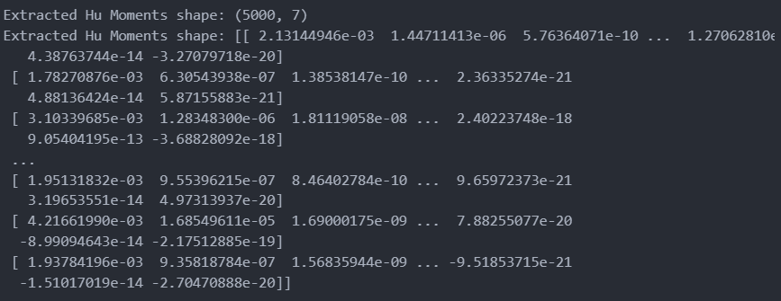
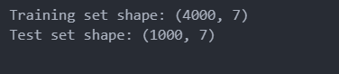
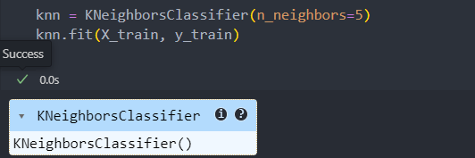

# Digit-Classification-using-Hu-Moments-and-K-Nearest-Neighbors-on-the-MNIST-Dataset   
This project aims to classify handwritten digits (0–9) from the MNIST dataset using a shape-based feature extraction method called Hu Moments combined with a simple yet powerful machine learning algorithm: K-Nearest Neighbors (KNN).     
      
Instead of using raw pixel data, which can be sensitive to noise and transformations, the project extracts 7 Hu moments from each image — features that are invariant to scale, rotation, and translation. These invariant features are then used to train a KNN classifier (with k=5), which classifies new digits based on similarity to known samples.     

## Step 1: Import Required Libraries   
```
import numpy as np
import cv2
from sklearn.datasets import fetch_openml
from sklearn.model_selection import train_test_split
from sklearn.neighbors import KNeighborsClassifier
from sklearn.metrics import accuracy_score
```

##  Step 2: Load the MNIST Dataset    
```
mnist = fetch_openml('mnist_784', version=1)
X = mnist.data
y = mnist.target.astype(np.int32)
```
## Step 3: Feature Extraction Using Hu Moments  
we Use a subset of the data for speed    
```
def extract_hu_moments(images):
    features = []
    for img in images:
        image_2d = img.astype(np.uint8)
        moments = cv2.moments(image_2d)
        hu_moments = cv2.HuMoments(moments).flatten()
        features.append(hu_moments)
    return np.array(features)

X_subset = X[:5000]
y_subset = y[:5000]
X_hu = extract_hu_moments(X_subset)
print("Extracted Hu Moments shape:", X_hu.shape)
print("Extracted Hu Moments shape:", X_hu)
```
<p align="center">
      
</p>   
  
## Step 4: Split the Dataset:    
uses 20% (1000 samples) for testing, 80% (4000) for training.    
```
X_train, X_test, y_train, y_test = train_test_split(X_hu, y_subset, test_size=0.2, random_state=42)
print("Training set shape:", X_train.shape)
print("Test set shape:", X_test.shape)
```
<p align="center">
      
</p>    
   
## Step 5: Train the KNN Classifier (k = 5):    
K-Nearest Neighbors is a supervised machine learning algorithm that classifies a data point based on how its neighbors are classified. It finds the K closest points in the training data and assigns the most common class among them to the new point.     
```
knn = KNeighborsClassifier(n_neighbors=5)
knn.fit(X_train, y_train)
```
<p align="center">
      
</p>      

## Step 6: Predict and Evaluate   
```
y_pred = knn.predict(X_test)
accuracy = accuracy_score(y_test, y_pred)
```
     
## K-Nearest Neighbors algorithm    
- Euclidean distance
- after sorted we Get indices of k closest points
- Get their labels
- Return the label with highest count
     
```
def knn_predict(x_test, X_train, y_train, k=5):
    distances = np.linalg.norm(X_train - x_test, axis=1)     
    k_indices = np.argsort(distances)[:k]    
    k_labels = y_train[k_indices]             
    unique, counts = np.unique(k_labels, return_counts=True)   
    return unique[np.argmax(counts)]          
```
   
    


